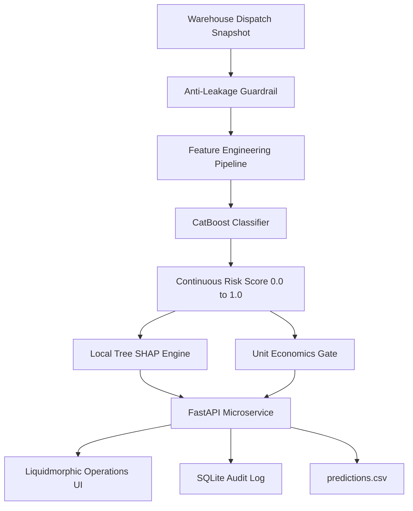

# Kestrel Home · Pre-Dispatch Return Risk Intelligence (Variant A)

[](https://python.org)
[](https://fastapi.tiangolo.com)
[](https://catboost.ai)
[](https://github.com/slundberg/shap)
[-success?style=flat-square)](https://docs.pytest.org)
[](https://render.com)
[-blue?style=flat-square)]()

A pre-dispatch return-risk classification service and operations intelligence console built for **Kestrel Home (Take-Home Variant A)**. Evaluates historical consignments, scores return risk at the warehouse packing table, explains drivers via local Tree SHAP, and routes consignments according to unit-economic break-even thresholds.

---

## 🌐 Live Deployed Application

- **Live Production URL (Render):** [https://kestrel-returns-risk.onrender.com](https://kestrel-returns-risk.onrender.com)  
  *(Alternative service link: [`https://kestrel-home-returns-risk.onrender.com`](https://kestrel-home-returns-risk.onrender.com))*
- **API Documentation (Swagger UI):** [https://kestrel-returns-risk.onrender.com/docs](https://kestrel-returns-risk.onrender.com/docs)
- **Repository (Private GitHub):** [https://github.com/sankalp250/Kestrel-Home-Returns-Risk-Variant-A-](https://github.com/sankalp250/Kestrel-Home-Returns-Risk-Variant-A-)
- **Video Walkthrough (3-Minute Demo):** `<PUBLIC_SCREEN_RECORDING_LINK>`

---

## 📑 Executive Summary & Business Economics

Kestrel's D2C operations face a major P&L drain from customer returns. This service replaces guesswork and arbitrary order holds with a mathematically grounded decision engine:

### The Numbers & The Rupees
- **All-in cost of a customer return:** **₹1,150** (reverse logistics, QC inspection, repackaging, and inventory write-down).
- **Cost of a completed pre-dispatch confirmation call:** **₹45** (outsourced tele-verification).
- **Observed pilot prevention rate:** A confirmation call successfully prevents **~35%** of returns on called orders (resolving model errors, incorrect addresses, or buyer remorse).

### Mathematical Break-Even Threshold Derivation
$$\text{Expected Saved Cost per Call} = 0.35 \times ₹1,150 = ₹402.50$$
$$\text{Break-even Return Probability } (p^*) = \frac{₹45}{₹402.50} \approx 11.18\%$$

```
   0% ──────────── 11.18% (Break-even) ──────── 20.0% ───────────── 100%
   │    LOW RISK       │        MEDIUM RISK       │     HIGH RISK      │
   │  Standard Send    │   Phone Confirmation     │  Supervisor Review │
   │ (Cost > Benefit)  │  (Saves ₹402 vs ₹45 Call)│  (Address & Hold)  │
```

- **Operational Threshold (~12%):** Orders with predicted risk $\ge 11.2\%$ are routed to **Confirmation Calls**.
- **Pushing Back on Blind Order Holds:** Operations originally requested *"hold all risky orders with 95% accuracy."* However, holding orders $>24$ hours causes **~12% customer cancellations**, while Shield VIP members (highest LTV segment) churn if delayed. The service therefore **never auto-cancels orders**—it prioritizes confirmation calls.

---

## 🏛️ System Architecture

```
┌────────────────────────────────────────────────────────────────────────┐
│                      WAREHOUSE DISPATCH SNAPSHOT                       │
│                        (test_unlabelled.csv)                           │
└───────────────────────────────────┬────────────────────────────────────┘
                                    │
                                    ▼
┌────────────────────────────────────────────────────────────────────────┐
│                        ANTI-LEAKAGE GUARDRAIL                          │
│   (Purges last_service_event_type and pickup_scheduled_at post-events) │
└───────────────────────────────────┬────────────────────────────────────┘
                                    │
                                    ▼
┌────────────────────────────────────────────────────────────────────────┐
│                     FEATURE ENGINEERING PIPELINE                       │
│  (Customer Tenure, Pincode Area, Basket-to-List Ratio, Note Keywords)  │
└───────────────────────────────────┬────────────────────────────────────┘
                                    │
                                    ▼
┌────────────────────────────────────────────────────────────────────────┐
│                         CATBOOST CLASSIFIER                            │
│                 (model/return_risk.cbm | ROC-AUC: 0.7795)              │
└───────────────────────────────────┬────────────────────────────────────┘
                                    │
                  ┌─────────────────┴─────────────────┐
                  ▼                                   ▼
┌───────────────────────────────────┐   ┌────────────────────────────────┐
│      LOCAL TREE SHAP ENGINE       │   │      UNIT ECONOMICS GATE       │
│  (Feature Attributions | ₹0 Cost) │   │ (11.2% Call Break-Even Target) │
└─────────────────┬─────────────────┘   └────────────────┬───────────────┘
                  │                                      │
                  └─────────────────┬────────────────────┘
                                    │
                                    ▼
┌────────────────────────────────────────────────────────────────────────┐
│                        FASTAPI INFERENCE ENGINE                        │
│                              (app/main.py)                             │
└───────────────────┬───────────────────┬───────────────────┬────────────┘
                    │                   │                   │
                    ▼                   ▼                   ▼
┌───────────────────────┐   ┌───────────────────────┐   ┌────────────────┐
│  LIQUIDMORPHIC WEB UI │   │   SQLITE AUDIT LOG    │   │PREDICTIONS.CSV │
│  (Operations Console) │   │(kestrel_predictions.db)│  │  (2,096 Rows)  │
└───────────────────────┘   └───────────────────────┘   └────────────────┘
```



---

## 🛡️ Anti-Leakage Defense (The Technical Trap)

The raw export contained two dangerous columns:
1. `last_service_event_type`: Logged events such as `REVERSE_PICKUP`.
2. `pickup_scheduled_at`: Timestamps generated when return logistics are booked.

> [!CAUTION]
> **Data Leakage Hazard:** Because historical exports were generated after order resolution, these fields contain **events that occurred days after delivery**. Training with these columns yields **~0.998 ROC-AUC**—a completely fake, non-operational model that collapses in production.

### Leakage Diagnostic Comparison

| Model Pipeline | Features Used | Validation ROC-AUC | Real Dispatch Viability |
|---|---|---|---|
| **Deliberately Leaked Model** | Order fields + `pickup_scheduled_at` + `last_service_event_type` | **~0.998** | ❌ **Invalid** (Signals do not exist at dispatch) |
| **Shipped Production Model** | Only signals known before the box is taped in the warehouse | **0.7795** | ✅ **100% Dispatch Safe** |

---

## 📊 Machine Learning Performance

- **Deduplication:** Collapsed **651 duplicate order rows** caused by partner-feed re-imports, prioritizing canonical CRM records.
- **Chronological Holdout:** Evaluated on future unseen orders starting **2026-04-02** (8,403 train / 2,101 validation rows, 11.52% return rate).

```json
{
  "roc_auc": 0.7795,
  "average_precision": 0.4053,
  "log_loss": 0.2975,
  "accuracy_at_0_5": 0.8924,
  "precision_at_0_5": 0.7667,
  "recall_at_0_5": 0.0950,
  "operational_precision_at_0_12": 0.2500,
  "operational_recall_at_0_12": 0.6529
}
```

### Top 10 Model Drivers (CatBoost Feature Importance)
1. **`payment_mode` (16.56%)**: Cash on Delivery (COD) orders display significantly elevated return rates over Prepaid UPI.
2. **`promised_delivery_days` (13.21%)**: Long delivery windows increase customer remorse.
3. **`customer_prior_returns` (10.92%)**: Past return history is the single strongest customer-level behavioral signal.
4. **`shield_member` (9.42%)**: Shield VIP status (free returns program).
5. **`customer_prior_return_rate` (8.11%)**: Ratio of historical returns to orders.
6. **`discount_value_inr` (7.38%)**: Absolute discount magnitude.
7. **`family` (3.75%)**: High-ticket appliance categories.
8. **`sales_channel` (3.73%)**: Marketplace orders vs. direct App purchases.
9. **`warranty_months` (3.42%)**: Appliance category coverage.
10. **`pincode_prefix` (2.74%)**: Regional logistics hub routing.

---

## 🎨 Operations Console (Liquidmorphic Glassmorphism)

The web interface is built using **pure Vanilla HTML5, CSS3, and JavaScript** (zero npm packages, zero Node build steps):

- **Liquidmorphism Background**: Continuous organic morphing fluid blobs (eucalyptus teal, Tuscan amber, and alpine mist) create live refraction behind frosted glass.
- **Strict Color Architecture**: **Zero pure black (`#000000`)** and **zero purple/violet**. Utilizes deep graphite slate (`#1e2c2e`), warm porcelain (`#f7f6f2`), Caspian teal (`#225c66`), and terracotta rust (`#b84335`).
- **Interactive Fluid Gauge**: Circular progress meter with a rising liquid fluid wave animating to the exact risk score.
- **Unit Economics Ruler**: Visual position marker highlighting distance to the 11.2% confirmation call threshold.
- **One-Click Scenario Presets**: Instant evaluation for **Low Risk (Prepaid)**, **Medium Risk (Shield VIP)**, **High Risk (COD)**, or **Next Unlabelled from Queue**.
- **Audit Log Drawer**: Displays real-time SQLite logged dispatches directly in the UI.

---

## 🔌 REST API Specification

### `POST /api/predict`
Calculates return risk and returns plain-English SHAP attributions.

#### Request Body
```bash
curl -X POST "https://kestrel-returns-risk.onrender.com/api/predict" \
     -H "Content-Type: application/json" \
     -d '{
       "order_id": "KO2610504",
       "order_placed_at": "2026-07-01 00:51",
       "customer_id": "CUST_1042",
       "sku": "SKU_AIRFRY_MAX",
       "sales_channel": "app",
       "payment_mode": "cod",
       "discount_pct": 15.0,
       "qty": 1,
       "order_value_inr": 4999.0,
       "promised_delivery_days": 4,
       "delivery_pincode": 560001,
       "is_gift": "N",
       "customer_prior_orders": 3,
       "customer_prior_returns": 1,
       "delivery_note": "Call before coming",
       "source": "crm"
     }'
```

#### Response (200 OK)
```json
{
  "order_id": "KO2610504",
  "score": 0.177952,
  "risk_band": "MEDIUM",
  "recommended_action": "CONFIRM_BEFORE_DISPATCH",
  "reasons": [
    "Previous return rate is 33%. This raised the model's risk estimate.",
    "Payment method is cod. This raised the model's risk estimate.",
    "Customer has 3 previous order(s). This reduced the model's risk estimate."
  ]
}
```

### Auxiliary Endpoints
- `GET /api/example?index=0`: Retrieves an order from the unlabelled test queue.
- `GET /api/presets`: Returns operational scenario profiles.
- `GET /api/history`: Returns recent dispatches logged to SQLite.
- `GET /api/stats`: Returns aggregate operational check metrics.

---

## 🚀 Deployment Guide (Render)

This repository includes turnkey Render configuration files ([render.yaml](file:///c:/Users/sanka/projects/personal/kestrel_returns_risk_submission/render.yaml), [Procfile](file:///c:/Users/sanka/projects/personal/kestrel_returns_risk_submission/Procfile), [.python-version](file:///c:/Users/sanka/projects/personal/kestrel_returns_risk_submission/.python-version)).

### Quick Deploy via Render Dashboard
1. Go to [Render Dashboard](https://dashboard.render.com).
2. Click **New +** $\rightarrow$ **Web Service**.
3. Connect your repository: `https://github.com/sankalp250/Kestrel-Home-Returns-Risk-Variant-A-`.
4. Configure the service settings:
   - **Name:** `kestrel-returns-risk`
   - **Runtime:** `Python 3`
   - **Region:** `Oregon (US West)` or `Frankfurt`
   - **Build Command:** `pip install -r requirements.txt`
   - **Start Command:** `uvicorn app.main:app --host 0.0.0.0 --port $PORT`
   - **Instance Type:** `Free`
5. Click **Create Web Service**. Your service will be live in ~2 minutes!

---

## 💻 Local Setup & Execution

### Prerequisites
- Python 3.11 or 3.12
- Git

### Installation
```powershell
# Clone the repository
git clone https://github.com/sankalp250/Kestrel-Home-Returns-Risk-Variant-A-.git
cd Kestrel-Home-Returns-Risk-Variant-A-

# Create virtual environment
python -m venv .venv

# Activate on Windows:
.\.venv\Scripts\activate
# Activate on macOS/Linux:
# source .venv/bin/activate

# Install dependencies
pip install -r requirements.txt
```

### Running the Test Suite & Validation
```powershell
# 1. Run all 7 automated unit and integration tests:
python -m pytest -v

# 2. Validate predictions.csv shape (2,096 rows, bounded [0, 1]):
python -m scripts.validate_submission

# 3. Retrain the model & regenerate metrics (optional):
python -m scripts.train

# 4. Generate predictions on test_unlabelled.csv:
python -m scripts.generate_predictions
```

### Launch the Application
```powershell
python -m uvicorn app.main:app --port 8000 --reload
```
Open **`http://127.0.0.1:8000`** in your browser.

---

## 💰 Financial Arithmetic: Cost per Prediction

In response to Finance Controller Farhan Sheikh's directive (*"no model bill that scales per order"*):

- **External LLM / Cloud Model Calls:** None (0)
- **Variable API cost per prediction:** **₹0**
- **Monthly model bill for Kestrel (approx. 700 orders/month):**
  $$700 \text{ orders} \times ₹0 = \mathbf{₹0\text{/month}}$$

The system runs entirely locally on commodity compute with **₹0 marginal cost per prediction**.

---

## 🔒 Client Data & Privacy Compliance

In accordance with Kestrel Operations Policy v4.1 (§10):
- Raw customer data and historical training labels (`train.csv`) are excluded from public distribution via [.gitignore](file:///c:/Users/sanka/projects/personal/kestrel_returns_risk_submission/.gitignore).
- All inference occurs inside the private deployment boundary—no customer data is transmitted to third-party AI APIs.

---

## 👤 Author & Submission Details
- **Assignment:** Kestrel Home — Returns Risk Pilot (Variant A)
- **Primary Deliverables:** [predictions.csv](file:///c:/Users/sanka/projects/personal/kestrel_returns_risk_submission/predictions.csv), [memo.pdf](file:///c:/Users/sanka/projects/personal/kestrel_returns_risk_submission/memo.pdf), [submission-answers.md](file:///c:/Users/sanka/projects/personal/kestrel_returns_risk_submission/submission-answers.md)
